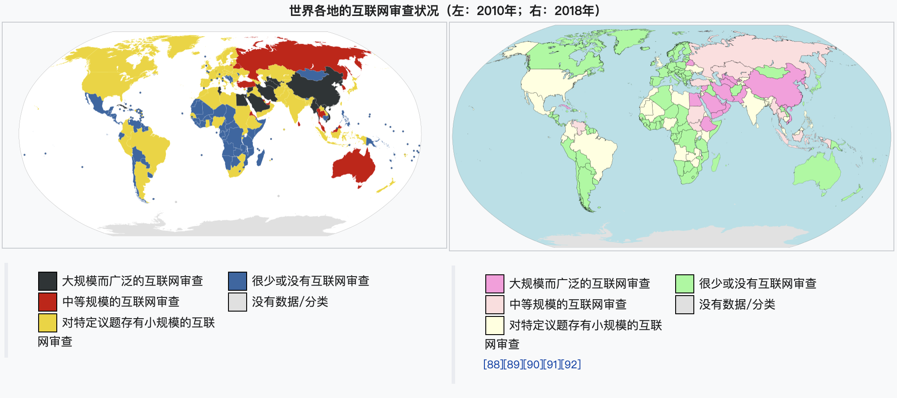

### 关键词概念

[virtual private network（vpn）](https://zh.wikipedia.org/wiki/%E8%99%9B%E6%93%AC%E7%A7%81%E4%BA%BA%E7%B6%B2%E8%B7%AF)

[Shadowsocks](https://zh.wikipedia.org/wiki/Shadowsocks)

[互联网审查](https://zh.wikipedia.org/wiki/%E4%BA%92%E8%81%94%E7%BD%91%E5%AE%A1%E6%9F%A5)

[防火长城](https://zh.wikipedia.org/wiki/%E9%98%B2%E7%81%AB%E9%95%BF%E5%9F%8E)

[突破网络审查(俗称翻墙)](https://zh.wikipedia.org/wiki/%E7%AA%81%E7%A0%B4%E7%BD%91%E7%BB%9C%E5%AE%A1%E6%9F%A5)

[host 文件](https://zh.wikipedia.org/wiki/Hosts%E6%96%87%E4%BB%B6)

## 自己的一些理解

### 互联网审查

互联网审查一般是以国家政府为单位的，限制自己国家的用户在互联网中搜索的内容信息。

一般限制的信息是关于 色情、宗教、同性恋、毒品、国家安全信息、法西斯等信息。
这种互联网审查在全世界大部分国家都会出现，不过限制的程度不一样。在中国，限制的信息尤其更多。

#### 审查手段

**技术性审查**

- 黑名单
  进行审查的实体一般会根据以下事物作审查：`关键字`、`域名`、`IP 地址`。审查者会按著从不同渠道获得的信息，来建构黑名单。在一些情况下，部分人/组织会向法院提供审查目标。此外亦有由政府部门主动发掘目标的例子（比如中国大陆和伊朗）

  霍夫曼（Hoffmann）举出了各种用于屏蔽特定网站或网页的技术：域名服务器缓存投毒、屏蔽特定 IP 地址、分析与屏蔽 URL 地址、检查过滤数据包、连接重置[12]。

- 方法
  - 对 IP 地址屏蔽
  - 利用 DNS 劫持，返回错误的 IP 地址
  - URL 地址栏会对关键字进行过滤
  - 数据包过滤，通过过滤器检测到数据包的敏感字眼，就会终止正在传输中的 TCP 数据包(可以利用 TLS/SSL 进行加密，防止被盗窃数据)

### 防火长城(Great Firewall 简称：GFW)

防火长城首要设计师：北邮前校长：方滨兴

是中华人民共和国政府监控和过滤国际互联网出口内容的**软硬件系统**集合，用于通过技术手段，阻断不符合中国政府要求的互联网内容传输

#### 主要技术

- 域名解析服务缓存污染
