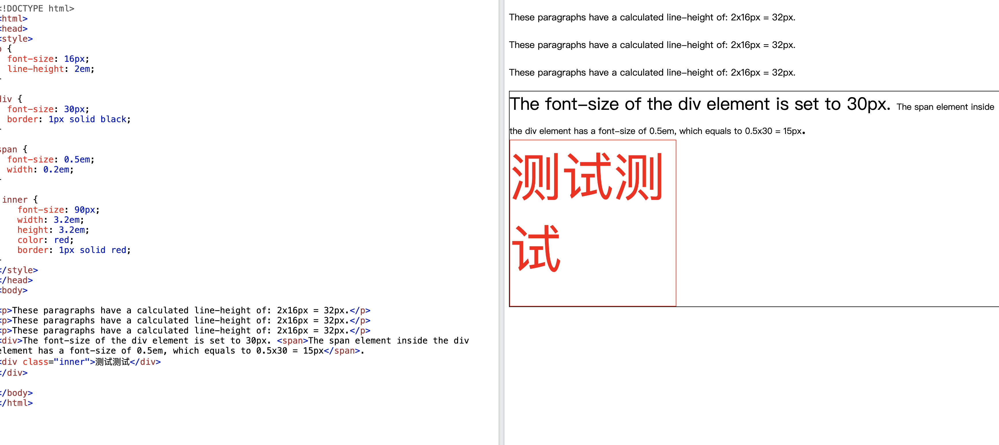

### 什么是响应式布局

响应式布局指的是同一页面在不同屏幕尺寸下有不同的布局。传统的开发方式是 PC 端开发一套，手机端再开发一套，而使用响应式布局只要开发一套就够。

### 响应式布局有哪几种方法

#### 媒体查询

```css
@media screen and (max-width: 960px) {
  body {
    background-color: #ff6699;
  }
}
```

#### vw 和 vh

针对视图窗口来进行设置

#### % 百分比

**相对于父级宽度的**：`max-width`、`min-width`、`width`、`left`、`right`、`text-indent`、`padding`、`margin`、`grid-template-columns`、`grid-auto-columns`、`column-gap` 等；
**相对于父级高度的**：`max-height`、`min-height`、`height`、`top`、`bottom`、`grid-template-rows`、`grid-auto-rows`、`row-gap` 等；
**相对于主轴长度的**：`flex-basis` 等；
**相对于继承字号的**：`font-size` 等；
**相对于自身字号的**：`line-height` 等；
**相对于自身宽高的**：`border-radius`、`background-size`、`border-image-width`、`transform: translate()`、`transform-origin`、`zoom`、`clip-path` 等；
**相对于行高的**：`vertical-align` 等；
**特殊算法的**：`background-position` （方向长度 / 该方向除背景图之外部分总长度）、`border-image-slice` （相对于图片尺寸）、`filter` 系列函数等；
如果自身设置 `position: absolute`，“父级”指：`Boring`：破坏文档流的 `div` 高度设为百分比是相对谁而言的？
如果 `position: fixed`，“父级”指视口（父级不存在 `transform` 为非 `none` 值的情况下）。

#### rem

相对于根元素的 font-size 来做标准单位大小

#### em

em 是一个相对于**元素本身字体**大小(font-size)的相对单位，它的值会继承父元素的字体大小。


