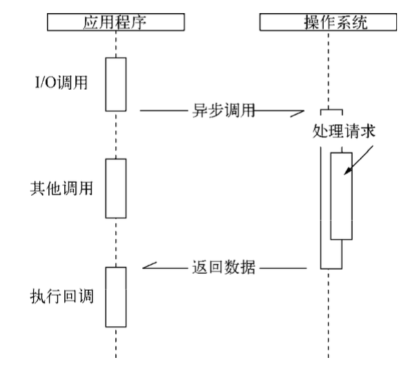

## Node 简介

Node 是在 2009 年，由`Ryan Dahl`开发实现的
Ryan Dahl 是一名资深的 C/C++程序员，在创造出 Node 之前，他的主要工作都是围绕**高性能 Web 服务器**进行的。经过一些尝试之后，他找到了设计高性能，Web 服务器的几个要点：事件驱动、异步 I/O。

由于 JS 本身的后端历史包袱少，以及学习成本相较于 c 要更低一些，并且 JS 本身就广泛使用事件驱动，以及 Chrome V8 的超强性能，所以 JS 成为了 Node 的实现语言。

Chrome 浏览器和 Node 的组件构成对比。 浏览器除了 V8 引擎外，还有一个`WebKit`布局引擎。以及浏览器的 API。

```bash
          Chrome                           Node
-------------------------         ------------------------
| HTML                JS |        |      JavaScript      |
| WebKit              V8 |        |         v8           |
|          中间层         |        |        中间层(libuv)  |
| 网卡  硬盘   显卡 ...    |        |       网卡、硬盘...    |
--------------------------        ------------------------
```

除了 `HTML`、`WebKit` 和显卡这些 `UI` 相关技术没有支持外，`Node` 的结构与 `Chrome` 十分相相似，它们都是基于事件驱动的异步结构，浏览器通过事件驱动来服务界面上的交互，`Node`通过事件驱动来服务`I/O`。

在 `Node` 中，`JS` 可以随心所欲的访问本地文件，可以搭建 `webSocket` 服务端，可以连接数据库，还可以如 `Web Workers` 一样玩转多进程。

`Node`打破了过去 JS 只能在浏览器中运行的局面。前后端编程环境统一，可以大大降低前后端转换所需要的上下文交换代价

### 异步 I/O

`Ryan Dahl`排除万难，在底层构建了很多异步`I/O`的 API，从文件读取到网络请求等，均是如此。这样的意义在于，在 Node 中，我们可以从语言层面很自然地进行**并行 I/O**操作。每个调用之间无须等待之前的 I/O 调用结束。

### 单线程

`Node`保持了`JS`在浏览器中单线程的特点。而且在 Node 中，JS 与其余线程是无法共享任何状态的。单线程的最大好处是不用像多线程编程那样处处在意状态的同步问题，这里没有死锁的存在，也没有线程上下文交换所带来的性能上的开销。

单线程的弱点：

- 无法利用多核 CPU
- 错误会引起整个应用退出，应用的健壮性值得考验
- 大量计算占用 CPU 导致无法继续调用异步 I/O

像浏览器中 JS 与 UI 共用一个线程一样,JS 长时间执行会导致 UI 的渲染和响应被中断。在 Node 中，长时间的 CPU 占用也会导致后续的异步 I/O 发不出调用，已完成的异步 I/O 的回调函数也会得不到及时执行。
Web Workers 能够创建工作线程来计算，以解决 JS 大计算阻塞 UI 渲染的问题，工作线程为了不阻塞主线程，通过消息传递的方式来传递运行结果，这也使得工作线程不能访问到主线程的 UI。
Node 采用了与 Web Workers 相同的思路来解决单线程中大计算量的问题：`child_process`。
子进程的出现，意味着 Node 可以从容应对单线程在健壮性和无法利用多核 CPU 方面的问题。将计算分发到各个子进程，可以将大量计算分解掉，然后再通过进程之间的事件消息来传递结果。这可以很好地保持应用模型的简单和低依赖。

### 跨平台

由于在 Node.js 和操作系统之间有了中间层`libuv`即可以实现跨平台。
`libuv` 是由 c++写的，所以跨平台的能力不错

### Node 的应用场景

#### I/O 密集型

I/O 密集的优势主要在于 Node 利用事件循环的处理能力，而不是启动每一个线程为每一个请求服务，资源占用极少。

#### 是否不擅长 CPU 密集型业务？

Node 在性能上是不俗的(基于 v8)，并且多个语言在计算斐波那契数列的耗时上，Node 的排名也算中等。另一方面，CPU 密集型应用其实也并不可怕。CPU 密集型应用给 Node 的挑战主要是 JS 是单线程的原因，如果 CPU 时间片不能及时释放，使得后续 I/O 无法发起。但是解决办法是可以适当调整和分解大型运算任务为多个小任务，使得运算能够适时释放，不阻塞 I/O 发起。这样便可以解决。

但是如果是纯计算，并且相当耗时的场景，更适合采用多线程的方式进行计算。解决方法：

- Node 可以通过编写 C/C++扩展的方式高效利用 CPU，这样的性能会比 java 还快
- 可以通过子进程的方式，将一部分 Node 进程当作常驻服务用于计算，然后利用进程间的消息来传递结果，将计算与 I/O 分离。

**CPU 密集并不可怕，如何合理调度才是关键**

#### 例子

- Node 带来的高性能 I/O 用于实时应用：结合 socket.io 用于实时语音、游戏
- 前端工具类的开发：webpack、npm、yarn

## 模块机制

### CommonJS 规范

#### 模块引用

```js
const math = require("math");
```

#### 模块定义

在 Node 中，一个文件就是一个模块(其实，目前在前端界，也是这么定义的)

#### 模块标识

模块标识其实就是传递给`require()`方法的参数，它必须是符合小驼峰命名的字符串，或者以`.、..`开头的相对路径或者绝对路径。它可以没有后缀名 js

模块的定义十分简单，接口也十分简单。它的意义在于将类聚的方法和变量等限定在**私有的作用域中**，同时支持引入和导出功能以顺畅地连接上下游依赖。

```js
+-------------+         +---------------+
| module      |         |    module     |
| require  <--|---------|--  exports    |
| exports     |         |               |
|-------------|         |---------------|
```

CommonJS 构建的这套模块导出和引入机制使得用户完全不必考虑变量污染，命名空间等方案与之相比相形见绌。

### Node 的模块使用

在 Node 中引入模块，需要经历如下 3 个步骤
1）路径分析
2）文件定位
3）编译执行
在 Node 中，模块分为两类：一类是 Node 提供的模块，称为**核心模块**；另一类是用户编写模块，称为**文件模块**。

#### 核心模块

这部分在 Node 源代码的编译过程中，编译成了**二进制文件**(直接类似编译型语言)，在 Node 进程启动时，部分核心模块就直接加载进内存中，所以这部分核心模块引入时，文件定位和编译执行这俩步骤可以省略掉，在路径分析中优先判断，加载速度也是最快的

#### 文件模块

是在**运行时动态加载**的，需要完整的路径分析、文件定位、编译执行过程，速度比核心模块慢。

### 模块加载 - 优先从缓存加载

注意：与前端浏览器会缓存静态脚本文件以提高性能一样，`Node`对引入过的模块都会进行缓存，以减少二次引入时的开销。不同的地方是，浏览器仅仅缓存文件，而 Node 缓存的是编译和执行之后的对象。

不论是**核心模块**还是**文件模块**，`require()`方法对相同模块的二次加载都一律采用缓存优先的方式，这是第一优先级。不同之处在于核心模块的缓存检查先于文件模块的缓存检查。

### 路径分析和文件定位

#### 模块标识符分析

`require()`方法接受一个标识符作为参数，在 Node 实现中，正是基于这样一个标识符进行模块查找的.模块标识符在 Node 中主要分为以下几类

- 核心模块，如`http`, `fs`, `path`等。
- .或者..开始的相对路径文件模块
- 以 `/` 开始的绝对路径文件模块
- 非路径形式的文件模块，如自定义的`connect`模块

##### 核心模块

其优先级仅次于缓存加载，它在 Node 的源代码编译过程中已经编译为二进制代码，其加载过程最快。
如果试图加载一个与核心模块标识符相同的自定义模块，那是不会成功的，如果自己编写了一个 http 用户模块，想要加载成功，必须选择一个不同的标识符或者换用路径的方式。

##### 路径形式的文件模块

以`.、.. 和 /`开始的标识符，这里都被当做文件模块处理。在分析路径模块时，require()方法会将路径转为真实路径，并以真实路径作为索引，将编译执行后的结果放在缓存中，以使二次加载时速度更快。

##### 自定义模块

自定义模块是指不属于上面两种模块，它是一种特殊的文件模块，可能是一个文件或者包的形式，这类模块的查找是最费时的，也是所有方式中最慢的。

#### 模块路径

模块路径的生成规则

- 当前文件目录下的 node_modules 目录
- 父目录下的 node_module 目录
- 沿路径向上逐级递归，直到根目录下的 node_modules 目录

#### 文件定位

- 文件扩展名分析。
  CommonJS 模块规范允许在标识符中不包含文件扩展名，这种情况下，Node 会按.js，.json，.node 的次序补足扩展名

### 模块编译

在 Node 中，每个文件模块都是一个对象，它的定义如下：

```js
function Module(id, parent) {
  this.id = id;
  this.exports = {};
  this.parent = parent;
  if (parent && parent.children) {
    parent.children.push(this);
  }
  this.filename = null;
  this.loaded = false;
  this.children = [];
}
```

在核心模块中，有些模块全部有 C/C++编写，有些模块则有 C/C++完成核心部分，其他部分则有 JS 实现包装或向外导出，以满足性能需求。后面这种 C++模块主内完成核心，JS 主外实现封装的模式是 Node 能够提高性能的常见方式。通常，脚本语言的开发速度优于静态语言，但是其性能则弱于静态语言。而 Node 的这种复合模式可以在开发速度和性能之间找到平衡点

### 模块调用栈

C/C++内建模块属于最底层的模块，是核心模块，主要提供 API 给 JS 核心模块和第三方 JS 文件模块调用。
JS 核心模块主要扮演的职责有两类：一类是作为 C/C++内建模块的封装层和桥接层，供文件模块调用；一类是纯粹的功能模块，它不需要跟底层打交道，又十分重要：

```bash
          |------------------------|
  文件模块 | JS模块 <-- C/C++扩展模块  |
          |-- ^^-------------------|
              ||
          |---||-------------------|
  核心模块 |   | \                  |
          |   |  JS 模块 <--|       |
          |  C/C++内建模块  -|        |
          |------------------------|

```

### 包与 NPM

通过 包和 npm 将第三方模块联系起来

#### 包结构

- package.json: 包描述文件
- bin: 用于存放可执行二进制文件的目录
- lib: 用于存放 JS 代码的目录
- doc: 用于存放文档的目录
- test: 用于存放单元测试用例的代码

#### 包描述文件与 npm

包描述文件用于表达非代码相关的信息，它是一个 JSON 格式的文件 --- `package.json`，位于包的根目录下，是包的重要组成部分。而 NPM 的所有行为都与包描述文件的字段息息相关。一些必要字段如下：

- name: 包的名字
- description: 包的简介
- version: 版本号
- keywords: 关键字搜索数组，用于做 npm 分类搜索
- maintainers: 包维护者列表。每个维护者用 name、email 和 web 这三个属性组成:`"maintainers": [{"name": "JT", "xxx@gmail.com", "web": "http:xxxx"}]`
- licenses: 当前包所使用的许可证列表，表示这个包可以在哪些许可证下使用，格式如下："licenses": [{"type": "xxx", "url": "xxxx"}]
- repositories: 托管源代码的位置列表，表明可以通过哪些方式和地址访问包的源代码。
- dependencies: 使用当前包所需要依赖的包列表。这个属性非常重要，npm 会通过这个属性帮助自动加载依赖的包
- scripts: 脚本说明对象。它主要被爆管理用来安装、编译、测试和卸载包。
- devDependencies: 一些模块只在开发时需要依赖。配置这个属性，可以提示包的后续开发者安装依赖包。

```bash
"scripts": {
  "build": "build.js",
  "start": "nodemon index.js",
  "test": "test.js"
}
```

#### npm 常用功能

对于 Node 而言，npm 帮助完成了第三方模块的发布、安装和依赖等。借助 NPM，Node 与第三方模块之间形成了很好的一个生态系统。

### 前后端共用模块

JS 在 Node 出现之后，比别的编程语言多了一项优势，那就是一些模块可以在前后端实现共用。

## 异步 I/O

Node 在出现之前，最习惯异步编程的程序员莫过于**前端工程师**。
前端编程算 GUI 编程的一种，其中充斥了各种 Ajax 和 事件，这些都是典型的异步应用场景。

但事实上，异步早就存在于操作系统的底层。在操作系统中，异步通过信号量、消息等方式有了广泛的应用。意外的是，在绝大多数高级编程语言中，异步并不多见，疑似被屏蔽了一般。造成这个现象的主要原因也许令人惊讶：程序员不太适合通过异步来进行程序设计。

**在众多高级编程语言或运行平台中，将异步作为主要编程方式和设计理念的，Node 是首个**

伴随着异步 I/O 的还有事件驱动和单线程，它们构成 Node 的基调

已经是思维层次的不同了。一般的后端程序员使用的 java、go 或者其他语言，他们更倾向于使用同步代码来书写，即便是有异步接口。

### 为什么要异步 I/O

从两方面说起：用户体验和资源分配

#### 用户体验

异步的概念之所以首先在 Web 2.0 中火起来，是因为在浏览器中 JS 在单线程上执行，而且它还与 UI 渲染共用一个线程。这意味着 JS 在执行的时候 UI 渲染和响应是处于停滞状态的。采用异步请求，就会解决掉资源等待时的卡顿问题，不影响用户的交互行为。在下载资源期间。JS 和 UI 的执行都不会处于等待状态。

并且如果采用的是异步，那么第一个资源的获取并不会阻塞第二个资源，也即第二个资源的请求并不依赖第一个资源的结束。如此，我们就可以享受并发的优势。

只有后端能够快速响应资源，才能让前端的体验更好。

#### 资源分配

计算机在发展过程中将组件进行了抽象，分为 I/O 设备和计算设备。
假设业务场景中有一组互不相关的任务需要完成，现行的主流方法有以下两种。

- 单线程串行依次执行
- 多线程并行完成

如果创建多线程的开销小于并行执行，那么多线程的方式是首选的。多线程的代价在于创建线程和执行期线程上下文切换的开销比较大。另外，在复杂的业务中，多线程编程经常面临锁、状态同步等问题，这是多线程被诟病的主要原因。但是多线程在多核 CPU 上能有效提升 CPU 的利用率，这个优势毋庸置疑。

单线程顺序执行任务的方式比较符合编程人员按顺序思考的思维方式。它依然是最主流的编程方式，因为它易于表达，但是串行执行的缺点在于性能。任何一个略慢的任务都会导致后续执行的代码被阻塞。 在计算机资源中，通常 I/O 与 CPU 计算之间是可以并行执行的。但是同步的编程模型的问题是，I/O 的进行会让后续任务等待，造成资源浪费。

Node 在二者之间给出了它的方案：利用单线程，远离多线程死锁、状态同步等问题；利用异步 I/O，让单线程远离阻塞，以更好地使用 CPU。

同时为了弥补单线程无法利用多核 CPU 的缺点，Node 提供了类似前端浏览器中 Web Workers 的子进程，该子进程可以通过工作进程高效地利用 CPU 和 I/O

异步 I/O 的提出是期望 I/O 的调用不再阻塞后续运算，将原有等待 I/O 完成的这段时间分配给其余需要的业务去执行。


#### 异步 I/O 与 非阻塞 I/O

在听到 Node 的介绍时，我们时常会听到异步、非阻塞、回调、事件这些词语混合在一起推介出来，但是从计算机内核 I/O 而言，异步/同步和阻塞/非阻塞实际是两回事。

操作系统内核对于 I/O 只有两种方式：阻塞和非阻塞。在调用阻塞 I/O 时，应用程序需要等待 I/O 完成才返回结果。
